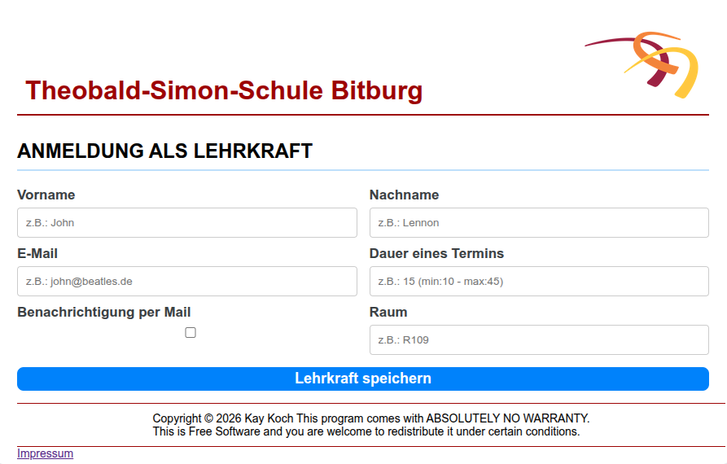
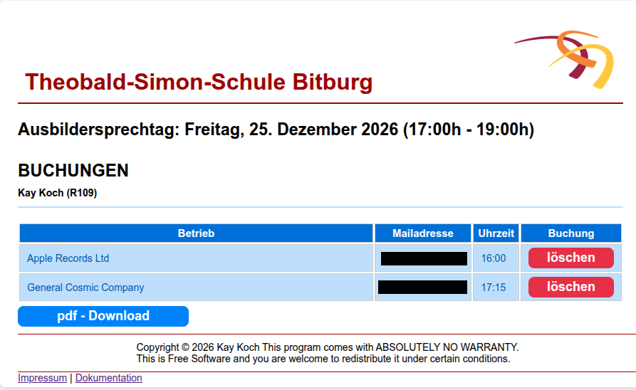
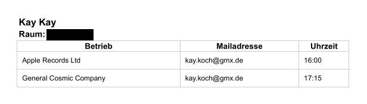
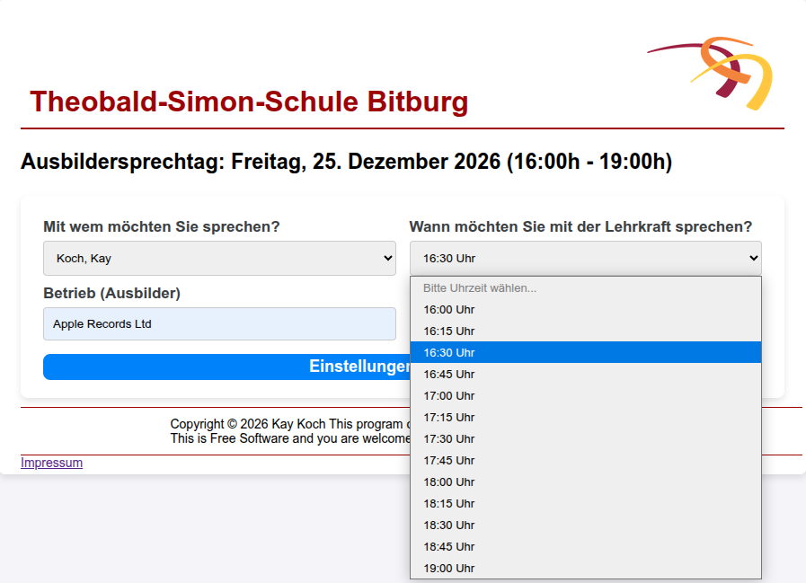
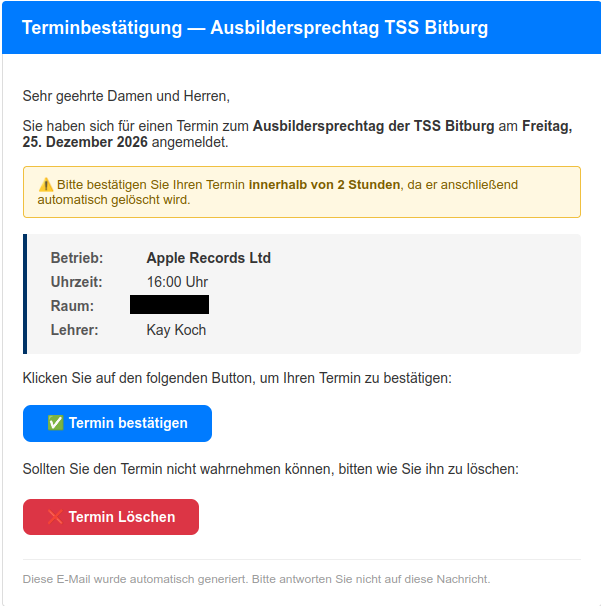
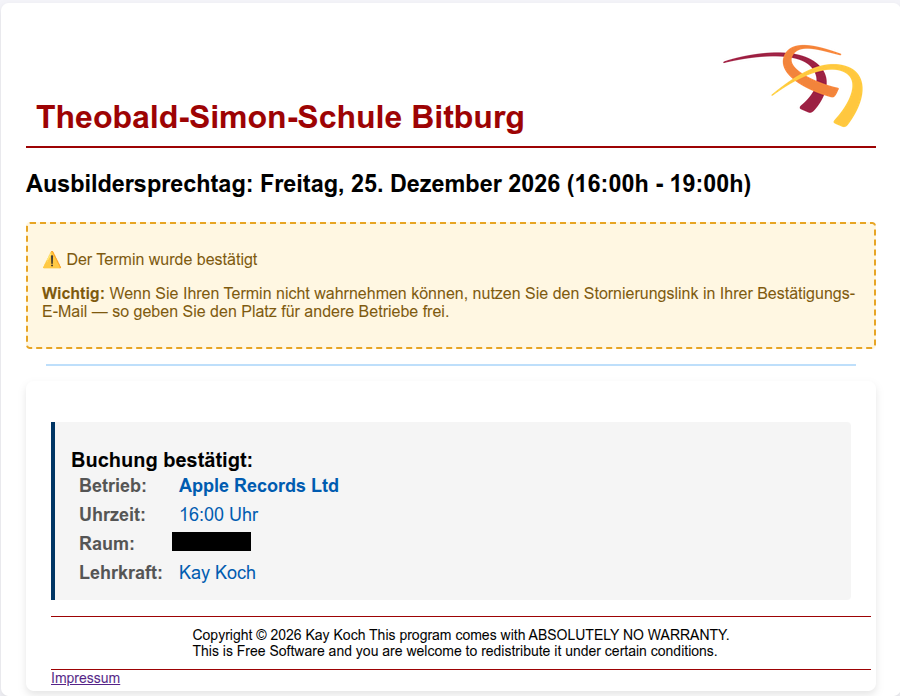

Bedienungsanleitung: Online-Portal zum Ausbilder- und Elternsprechtag
==============

### Einleitung
Der Ausbilder- und Elternsprechtag an Schulen ist ein zentrales Instrument zur För­derung des Dialogs zwischen der Schule und den dualen Ausbildungsbetrieben bzw. den Erziehungsberechtigten. Um die Orga­nisation dieses Austauschs – analog zum klassischen Elternsprechtag – effizient, transparent und zeitsparend zu gestalten, wird eine webbasierte Anwendung eingesetzt.
# Inhaltsverzeichnis
- [Installation](##installation)
- [Webserver, Lokal](#lokal)
- [Webserver, Internet](#server)
- [Ablauf für Lehrkräfte](#ablauf-für-lehrkräfte)
- [Ablauf für Ausbildungsbetriebe](#ablauf-für-ausbildungsbetriebe)

## Installation
Die Installation erfolgt über setup.py. Das Programm installiert eine virtuelle Umgebung und alle notwendigen Bibliotheken.
Zusätzlich wird [Gunicorn](https://gunicorn.org) instaliert. Ein Web Server Gateway Interface (WSGI) HTTP Server 

### Voraussetzungen
Auf dem Server muss python3 (>= 3.11), pip3 und python3-venv installiert sein
Je nach dem, wie Ihr das repository herunterladet muss noch git oder zip installiert werden

### Installation
```bash 
# Erstellen eines Zielordners
mkdir erfass
# In Ordner hineinspringen                            
cd erfass
# Herunterladen der App                                
git clone https://github.com/kaykoch/Ausbildersprechtag.git
# Setup-Programm starten
python3 setup.py                                
```
## Programmstart
### Lokal
Wenn das Programm zum testen auf dem lokalen PC gestartet werden soll:
- venv starten (im Ordner "erfass"): 
```bash 
source .venv/bin/activate
```
- Programm starten: (Sollte die die App nicht starten, liegt es vielleicht daran, dass sie nicht ausführbar ist)
```bash 
./erfass.py
```
In dem Fall:

- entweder jedes Mal: 
```bash
python3 ./erfass.py
```
- oder (dringend empfohlen) einmalig die Datei ausführbar machen: 
```bash
 chmod +x erfass.py 
 ```
und in Zukunft, wie beschrieben: 
```bash 
./erfass.py
```

**erfass.py:** \
Man kann die App im Debug Mode laufen lassen. Das führt dazu, dass bei Änderungen am Code nicht neu gestartet werden muss. \
Im Quelltext:

```python
app.run(debug=False)  # (! ZWINGEND FÜR SERVEREINSATZ !)
```

```python
app.run(debug=True)  # App startet selbstständig neu (! NUR FÜR DEN LOKALEN EINSATZ !)
``` 

Der Aufruf erfolgt im Browser mit: 
   ```
  http://localhost:5000/
  ``` 

bzw. für die Administration:  (Login: admin | Password: admin)
  ```
  http://localhost:5000/admin
  ``` 
 

### Server
Wenn das Programm im produktiven Einsatz laufen, kommt GuniCorn ins Spiel. \
Hierfür gibt es das Startscript: (Es gilt für die Ausführbarkeit das gleiche wie oben.) 
```bash 
startGunicorn.py
```


**startGunicorn.py:** \
Es gibt drei Parameter im script, die man ändern kann:\
Im Quelltext:
```python
# beliebiger Name für die Applikation. Dient nur zur Unterscheidung bei mehreren GuniCorn Anwendungen
APP_NAME = (
    "sprechtag"  
)
# Port auf dem der Server hört
PORT = "8081"
# Anzahl der gestarteten Dienste. Nur interessant bei zu erwartender hoher Last
WORKERS = 1  
```
Der Aufruf erfolgt im Browser mit: 
   ```
  http://<SERVER_URL>:PORT/
  ``` 

bzw. für die Administration:
  ```
http://<SERVER_URL>:PORT//admin
  ``` 
Dieses Handbuch führt Sie Schritt für Schritt durch das System. Es deckt sowohl Ihre eigene Registrierung und Terminverwaltung als auch den Prozess aus Sicht der Ausbildungsbetriebe ab, damit Sie bei Rückfragen Ihrer Auszubildenden oder der Betriebe fundiert Auskunft geben können.

# Ablauf für Lehrkräfte

## Erstanmeldung und Registrierung

>*Abbildung 1: Registrierungsseite*

Für die initiale Anmeldung der Lehrkräfte stellt das System ein übersichtliches Online-Formular zur Verfügung. Gehen Sie hierfür wie folgt vor:

1. Rufen Sie die Anmeldeadresse im Webbrowser auf. Die URL sowie das erforderliche Zugangspasswort entnehmen Sie bitte dem offiziellen Aushang im Lehrerzimmer.

2. Füllen Sie die Pflichtfelder auf der Registrierungsseite aus:

   - **Vorname & Nachname:** Tragen Sie hier Ihre vollständigen Namensdaten ein. (Abbildung 1)

   - **E-Mail:** Nutzen Sie vorzugsweise Ihre dienstliche E-Mail-Adresse (`@tssbit.de`).

   - **Dauer eines Termins:** Wählen Sie die gewünschte Taktung pro Gespräch in Minuten (Standardvorgabe: 15, konfigurierbar zwischen 10 und 45 Minuten).

   - **Raum:** Geben Sie den Raum an, in dem Sie während des Sprechtags physisch erreichbar sind (z. B. *R109*).

   - **Benachrichtigung per Mail:** Setzen Sie hier ein Häkchen, falls Sie bei jeder neuen Terminbuchung eines Betriebes automatisch eine Benachrichtigung per E-Mail erhalten möchten.

   - Klicken Sie abschließend auf die blaue Schaltfläche **\[Lehrkraft speichern\]**, um Ihr Profil im System anzulegen.

## Registrierungsbestätigung und Account-Zugriff

Unmittelbar nach der Speicherung generiert das System eine automatisierte E-Mail mit dem Betreff `Registrierung — Ausbildersprechtag TSS Bitburg`.

Diese enthält eine Zusammenfassung Ihrer hinterlegten Daten (Name, Raum, gewählte Termindauer und Mail-Benachrichtigungsstatus) sowie eine zentrale, blaue Schaltfläche mit der Aufschrift **\[Daten ändern / Termin einsehen\]**.

> ⚠️ **Wichtig:** Bewahren Sie diese E-Mail gut auf! Über den darin enthaltenen Link können Sie jederzeit – auch zu einem späteren Zeitpunkt – ohne erneute Passworteingabe auf Ihr Dashboard zugreifen, um Änderungen vorzunehmen.


## Einstellungen und Buchungen

>*Abbildung 2:  Buchungen*


Sobald Sie Ihr Dashboard über den Link aus der Bestätigungs-E-Mail aufrufen, erhalten Sie vollen Zugriff auf Ihre persönlichen Daten und ihren aktuellen Buchungsstatus **\[Einstellungen\] \[Buchungen\]**.:

- **Einstellungen:** Sie können Ihre Profildaten (Raum, Mail-Präferenz etc.) bei Bedarf durch die Schaltfläche Einstellungen ändern. Sie werden dann auf die Eingabemaske () weitergeleitet. Dort finden Sie ihre aktuellen Daten eingetragen und können sie bei Bedarf ändern.

- **Buchungen: Einsicht in alle Buchungen erhalten sie mit der Schaltfläche Buchungen. (Abbildung 2)**

- **💡 Hinweis zu Tooltips: Wenn Sie mit der Maus über die einzelnen Eingabefelder fahren, erscheinen hilfreiche Tooltips mit zusätzlichen Erläuterungen und Formatvorgaben.**

- **Termine löschen:** Sollte unvorhergesehen ein Termin aus organisatorischen Gründen gelöscht werden müssen, befindet sich in der Spalte *Buchung* neben dem jeweiligen Eintrag eine rote Schaltfläche **\[löschen\]**. Ein Klick entfernt die Buchung und gibt das Zeitfenster sofort wieder für andere Betriebe frei.

- **PDF-Export der Terminliste:** Um am Sprechtag selbst eine ausgedruckte oder digitale Übersicht parat zu haben, klicken Sie unterhalb der Tabelle auf die blaue Schaltfläche **\[pdf - Download\]**. Das System erzeugt daraufhin eine übersichtliche PDF-Terminliste, welche Ihren Namen, den zugewiesenen Raum sowie die chronologische Tabelle der angemeldeten Betriebe enthält.(Abbildung 3)

> *Abbildung 3: PDF-Terminliste*

# Ablauf für Ausbildungsbetriebe

Damit Sie genau wissen, wie der Prozess auf Seiten der Wirtschaftspartner abläuft, ist nachfolgend das Anmeldeverfahren aus Sicht der Betriebe dargestellt.

## Verteilung der Zugangsdaten

Die Ausbildungsbetriebe erhalten die spezifische Webadresse für die Anmeldung über die Schülerinnen und Schüler. Die Auszubildenden leiten die URL direkt an ihre jeweiligen Ausbilder im Betrieb weiter. (Abbildung 4)

## Terminauswahl und Datenübermittlung
Wenn ein Ausbilder die Anmeldeseite aufruft, führt er die Anmeldung in folgenden Schritten durch:

> *Abbildung 4: Startseite für Betriebe (mit ausgeklappter Zeitenliste)*


1. **Auswahl der Lehrkraft:** Auf der Startseite für Betriebe wählt der Ausbilder aus dem Dropdown-Menü *„Mit wem möchten Sie sprechen?“* die gewünschte Lehrkraft aus.

2. **Zeitfenster wählen:** Im daneben stehenden Dropdown-Menü *„Wann möchten Sie mit der Lehrkraft sprechen?“* werden dynamisch alle noch freien Uhrzeiten der ausgewählten Lehrkraft angezeigt. Bereits belegte Zeiten sind automatisch ausgeblendet. (Abbildung 4)

3. **Betriebsdaten angeben:** Der Ausbilder trägt den Namen des Betriebs (z. B. *„Apple Records Ltd“*) sowie eine gültige E-Mail-Adresse in die dafür vorgesehenen Felder ein und klickt auf **\[Einstellungen speichern\]**.

4. **Sende-Bestätigung:** Direkt im Browser wird eine visuelle Bestätigung angezeigt (*„Termin gebucht für... um...“*), verbunden mit dem Hinweis, dass eine Verifizierungs-Mail an den Betrieb versendet wurde ().


## Zweistufiges Bestätigungsverfahren (Double-Opt-In)
Zum Schutz vor Fehlbuchungen und Blockaden nutzt die Anwendung ein striktes Bestätigungsverfahren per E-Mail

> *Abbildung 6: Verifizierungs-E-Mail*


- **E-Mail-Eingang:** Der Betrieb erhält eine Nachricht mit dem Betreff `Terminbestätigung — Ausbildersprechtag TSS Bitburg`.

- ⏱️ **2-STUNDEN-FRIST:** Der Termin muss zwingend **innerhalb von 2 Stunden** vom Betrieb bestätigt werden. Erfolgt dies nicht, löscht das System die Reservierung automatisch und gibt das Zeitfenster wieder frei.

- **Interaktionsmöglichkeiten in der E-Mail:** Die Nachricht enthält zwei markante Buttons:

  - **\[Grünes Häkchen - Termin bestätigen\]:** Schließt die Buchung verbindlich ab.

  - **\[Rotes X - Termin Löschen\]:** Gibt den Termin sofort wieder für andere Betriebe frei, falls er irrtümlich ausgewählt wurde.

- **Erfolgreicher Abschluss:** Sobald der Betrieb in der E-Mail auf den Bestätigungsbutton geklickt hat, öffnet sich die finale Bestätigungsseite im Portal. Sie signalisiert *„Der Termin wurde bestätigt“* und fasst alle Daten (Betrieb, Uhrzeit, Raum und Name der Lehrkraft) in einer übersichtlichen Übersichtskarte zusammen.

> *Abbildung 7: Finale Bestätigungsansicht*